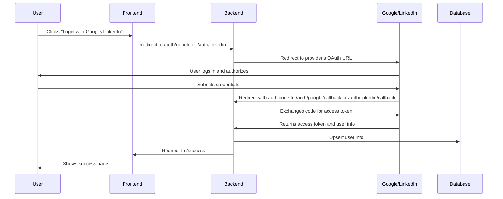

# SM-Login-Service
This service authenticates user logins via social media sites using a MERN architecture

## Environment Setup

1. After cloning or downloading this project, copy the sample environment file:
   
	```sh
	cp .env.example .env
	```

2. Open the new `.env` file and fill in your own credentials for Google and LinkedIn OAuth, as well as a random session secret:

	- `GOOGLE_CLIENT_ID` and `GOOGLE_CLIENT_SECRET`: Get these from the Google Developer Console.
	- `LINKEDIN_CLIENT_ID` and `LINKEDIN_CLIENT_SECRET`: Get these from the LinkedIn Developer Portal.
	- `SESSION_SECRET`: Use any long, random string.

3. Save the `.env` file. Do not share this file or commit it to version control.


4. Start the backend and frontend as described below.

## How to Run the Project

### 1. Prerequisites

- [Node.js](https://nodejs.org/) (v16 or later recommended)
- [npm](https://www.npmjs.com/)
- [MongoDB](https://www.mongodb.com/try/download/community) (running locally on default port 27017)

### 2. Install Dependencies

In the project root:

```sh
npm install
```

Then, in the `client` folder:

```sh
cd client
npm install
```

### 3. Start MongoDB

Make sure MongoDB is running. On Windows, you can use:

```
net start MongoDB
```
or run `mongod` in a terminal.

### 4. Start the Backend

In the project root:

```sh
node server.js
```

The backend will run on [http://localhost:3001](http://localhost:3001) by default.

### 5. Start the Frontend

In the `client` folder:

```sh
npm start
```

The frontend will run on [http://localhost:3000](http://localhost:3000) by default.


### 6. OAuth Setup

- Register your app with Google and LinkedIn to get client IDs and secrets.
- Set the correct redirect URIs in the provider dashboards:
	- Google: `http://localhost:3001/auth/google/callback`
	- LinkedIn: `http://localhost:3001/auth/linkedin/callback`
- For LinkedIn, you must also provide a public Privacy Policy URL: [https://rocketcan.github.io/SM-Login-Service/privacy-policy/](https://rocketcan.github.io/SM-Login-Service/privacy-policy/)

### 7. Usage

- Open [http://localhost:3000](http://localhost:3000) in your browser.
- Click a social login button to authenticate.
- After login, you will be redirected to a success page with a button to view your user info.

## Social Media Authentication Flow Diagrams

### Google/LinkedIn OAuth 2.0 Flow



**Summary:**
- The user initiates login from the frontend.
- The backend handles the OAuth flow and securely stores user info.
- The user is redirected to a success page after authentication.

---
